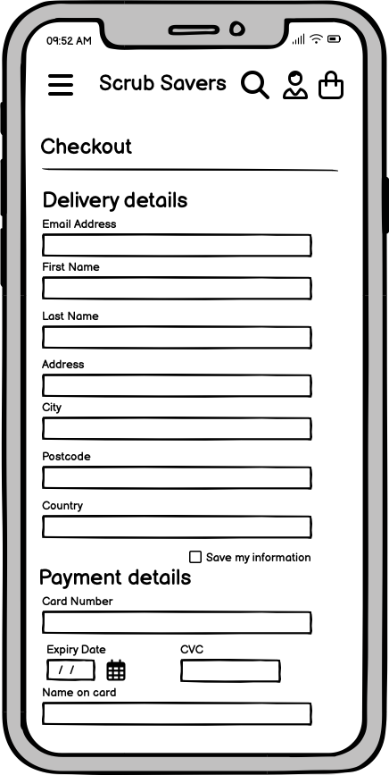
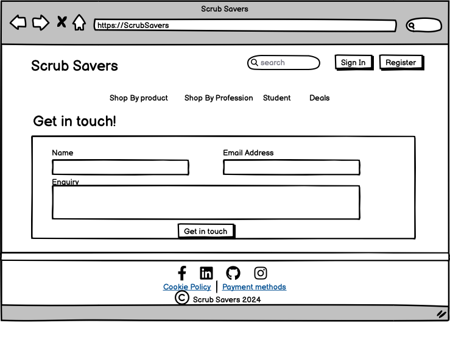

# [SCRUB SAVERS](https://scrub-savers-5f33124f2ec3.herokuapp.com/)

[](https://github.com/mikavir/scrub-savers/commits/main)
[](https://github.com/mikavir/scrub-savers/commits/main)
[](https://github.com/mikavir/scrub-savers)


source: [amiresponsive](https://ui.dev/amiresponsive?url=https://scrub-savers-5f33124f2ec3.herokuapp.com)

Scrub Savers isn e-commerce web application built with Django, catering to healthcare and medical professionals. The site specializes in selling a wide range of medical clothing and equpment. Designed for ease of use, Scrub Savers ensures a seamless shopping experience, from browsing to checkout. Whether you're looking for scrubs, tools, or medical accessories, Scrub Savers provides everything in one convenient place.

## UX


### Colour Scheme

Hues of blue and white have been chosen because they are synonymous with healthcare in the UK. According to the [National Health Service (NHS)](https://www.england.nhs.uk/nhsidentity/identity-guidelines/colours/), 87% of people spontaneously recall these colors when asked about the NHS identity . For an e-commerce website aimed at healthcare professionals, this color scheme is ideal due to its strong association with the field.


I used [coolors.co](https://coolors.co/081f5c-334eac-7096d1-d0e3ff-e1eaef-fff9f0-f7f2eb) to generate my colour palette.


### Typography

After researching fonts closely associated with healthcare websites, [Typ.io](https://typ.io/tags/medical#:~:text=If%20you're%20working%20on,Nunito%20Sans%2C%20Publico%20and%20Titillium.) recommends Avenir Next and Tiempos. Since these were not accessible, we chose close replacements: Montserrat and Lora. 
Ensuring that the typography is consistent with other healthcare websites is vital for maintaining strong visual associations with the industry. This consistency will enhance engagement with our target audience.

- [Montserrat](https://fonts.google.com/specimen/Montserrat) was used for the primary headers and titles.

- [Lora](https://fonts.google.com/specimen/Lora) was used for all other secondary text.

- [Font Awesome](https://fontawesome.com) icons were used throughout the site, such as the social media icons in the footer.

## User Stories
### Viewing and Navigation

- As a Shopper, I want to be able to view a list of products so that I can select items to purchase.
- As a Shopper, I want to be able to view individual product details so that I can identify the price, description, and product details.
- As a Shopper, I want to quickly identify deals, clearance items, and special offers so that I can take advantage of special savings on - products I'd like to purchase.
- As a Shopper, I want to easily view the total of my purchases at any time so that I can avoid overspending.

### Registration and User Authentication

- As a Shopper, I want to easily register for an account so that I can have a personal account to view my purchase history.
- As a Shopper, I want to easily log in to my account so that I can keep track of my purchase history.
- As a Shopper, I want to easily log out of my account so that my account is secure when using a public device.
- As a Shopper, I want to easily recover my password in case I forget it so that I can recover access to my account.
- As a Shopper, I want to receive an email confirmation after signing in so that I can verify that my account registration was successful.
- As a Shopper, I want to have a personalized user profile so that I can view my purchase history, order confirmations, and save my payment history.

### Sorting and Searching

- As a Shopper, I want to sort the list of available products so that I can easily identify the best-rated, best-priced, and categorically sorted products.
- As a Shopper, I want to sort a specific category of products so that I can find the best-priced or best-rated products in that category or sort them by name.
- As a Shopper, I want to sort multiple categories or products simultaneously so that I can find the best-priced or best-rated products across broad categories, such as clothing or medical items.
- As a Shopper, I want to search for a product by name or description so that I can find the specific product I want to purchase.
- As a Shopper, I want to easily view what I have searched for and the number of results so that I can quickly identify if the product I'm searching for is available.

### Purchasing and Checkout

- As a Shopper, I want to easily select the size and quantity of a product when purchasing it so that I don't accidentally select the wrong size.
- As a Shopper, I want to view items in my bag to be purchased so that I can identify the total cost of the items I'm purchasing.
- As a Shopper, I want to adjust the quantity of individual items in my bag so that I can easily make changes to my purchase before checkout.
- As a Shopper, I want to easily enter my payment information so that I can checkout quickly.
- As a Shopper, I want to view an order confirmation after checkout so that I can verify that I haven't made any mistakes.
- As a Shopper, I want to receive an email confirmation after my purchase so that I have a record of my purchase.

### Admin and Store Management

- As a Store Owner, I want to add a product so that I can add new items to my store.
- As a Store Owner, I want to edit a product so that I can change the product information easily.
- As a Store Owner, I want to delete a product so that I can remove items that are no longer for sale.
- As a Store Owner, I want to have a logo so that I can improve my brand identity.

### Contact and Questions

- As a Shopper, I want to see contact information so that I can feel safe knowing that I can contact someone to remedy any mistakes.
- As a Shopper, I want to see questions and answers so that I can understand more about what happens during my purchase.
- As a Shopper, I want to see reviews so that I can understand the quality of the product I'm buying.
- As a Store Owner, I want to be contacted so that I can improve customer loyalty and understand if there are improvements to be made.

## Wireframes

To follow best practice, wireframes were developed for mobile, tablet, and desktop sizes.
I've used [Balsamiq](https://balsamiq.com/wireframes) to design my site wireframes.

### Mobile Wireframes

<details>
<summary> Click here to see the Mobile Wireframes </summary>


Home
  - 
  - 

Login
  - 

Register
  - 

Products
  - 

Product details
  - 

Bag
  - 

Checkout
  - 
  - 

Profile
  - 

Contact
  - 

</details>

### Tablet Wireframes

<details>
<summary> Click here to see the Tablet Wireframes </summary>

Home
  - 
  - 

Login
  - 

Register
  - 

Products
  - 

Product details
  - 

Bag
  - 

Checkout
  - 
  - 

Profile
  - 

Contact
  - 

</details>

### Desktop Wireframes

<details>
<summary> Click here to see the Desktop Wireframes </summary>


Home
  - 
  - 

Login
  - 

Register
  - 

Products
  - 

Product details
  - 

Bag
  - 

Checkout
  - 
  - 

Profile
  - 

Contact
  - 

</details>

## Features

🛑🛑🛑🛑🛑🛑🛑🛑🛑🛑 START OF NOTES (to be deleted)

In this section, you should go over the different parts of your project,
and describe each in a sentence or so.

You will need to explain what value each of the features provides for the user,
focusing on who this website is for, what it is that they want to achieve,
and how your project is the best way to help them achieve these things.

For some/all of your features, you may choose to reference the specific project files that implement them.

IMPORTANT: Remember to always include a screenshot of each individual feature!

🛑🛑🛑🛑🛑🛑🛑🛑🛑🛑-END OF NOTES (to be deleted)

### Existing Features

- **YOUR-TITLE-FOR-FEATURE-#1**

    - Details about this particular feature, including the value to the site, and benefit for the user. Be as detailed as possible!


- **YOUR-TITLE-FOR-FEATURE-#2**

    - Details about this particular feature, including the value to the site, and benefit for the user. Be as detailed as possible!


- **YOUR-TITLE-FOR-FEATURE-#3**

    - Details about this particular feature, including the value to the site, and benefit for the user. Be as detailed as possible!


🛑🛑🛑🛑🛑🛑🛑🛑🛑🛑 START OF NOTES (to be deleted)

Repeat as necessary for as many features as your site contains.

Hint: the more, the merrier!

🛑🛑🛑🛑🛑🛑🛑🛑🛑🛑-END OF NOTES (to be deleted)

### Future Features

🛑🛑🛑🛑🛑🛑🛑🛑🛑🛑 START OF NOTES (to be deleted)

Do you have additional ideas that you'd like to include on your project in the future?
Fantastic! List them here!
It's always great to have plans for future improvements!
Consider adding any helpful links or notes to help remind you in the future, if you revisit the project in a couple years.

🛑🛑🛑🛑🛑🛑🛑🛑🛑🛑-END OF NOTES (to be deleted)

- YOUR-TITLE-FOR-FUTURE-FEATURE-#1
    - Any additional notes about this feature.
- YOUR-TITLE-FOR-FUTURE-FEATURE-#2
    - Any additional notes about this feature.
- YOUR-TITLE-FOR-FUTURE-FEATURE-#3
    - Any additional notes about this feature.

## Tools & Technologies Used

- [](https://tim.2bn.dev/markdown-builder) used to generate README and TESTING templates.
- [](https://git-scm.com) used for version control. (`git add`, `git commit`, `git push`)
- [](https://github.com) used for secure online code storage.
- ⚠️⚠️ CHOOSE ONLY ONE <-- delete me ⚠️⚠️
- [](https://gitpod.io) used as a cloud-based IDE for development.
- [](https://en.wikipedia.org/wiki/HTML) used for the main site content.
- [](https://en.wikipedia.org/wiki/CSS) used for the main site design and layout.
- [](https://www.javascript.com) used for user interaction on the site.
- [](https://jquery.com) used for user interaction on the site.
- [](https://www.python.org) used as the back-end programming language.
- [](https://www.heroku.com) used for hosting the deployed back-end site.
- ⚠️⚠️ CHOOSE ONLY ONE (if applicable) <-- delete me ⚠️⚠️
- [](https://getbootstrap.com) used as the front-end CSS framework for modern responsiveness and pre-built components.
- [](https://www.djangoproject.com) used as the Python framework for the site.
- [](https://dbs.ci-dbs.net) used as the Postgres database from Code Institute.
- [](https://cloudinary.com) used for online static file storage.
- [](https://whitenoise.readthedocs.io) used for serving static files with Heroku.
- [](https://stripe.com) used for online secure payments of ecommerce products/services.
- [](https://mail.google.com) used for sending emails in my application.
- [](https://balsamiq.com/wireframes) used for creating wireframes.
- [](https://www.canva.com/p/canvawireframes) used for creating the logo.
- [](https://fontawesome.com) used for the icons.
- [](https://chat.openai.com) used to help debug and writing content.

## Database Design

Entity Relationship Diagrams (ERD) help to visualize database architecture before creating models.
Understanding the relationships between different tables can save time later in the project.

This is the ERD design prior to the development. 


During the development, I have made new models and altered the relationsips between the models. I've used [Mermaid](https://mermaid.live) to generate an interactive version of my ERD.


Source: [Mermaid](https://mermaid.live/edit#pako:eNq1VT1v2zAQ_SsC52RoRq_pEqBAixbdDBA0eZavoEj1eIyrOP7vpSTLtkR_KEO0SLx79_hIPp52QnsDYiGAvqIqSVVLV6TnWTGUnppi14_bBx0XaE7jwISuLJyqIAuuCcEZ28hTdr90_ccP8msIAb37DPZnb32k8EnCTdT8YWqGf1wYCJqw5rTsU8aAxkrZoibUkIdJcWI7xVfe22Kjggz4BiGbNdWUU83fyQDNUOxbnHSxWgHlmxKtlRe3CyqFNovWG-_gGpn20TE1eZEP3JoxS7DfOulJauS8Kr0AWCpjKHnqy53802U1Z7QmGZ-xgu4jPxEDFl-BGqmT2jzd7yJ7VjZPptvlzDTZecMTluiUlStVXloB1iDr4dDGR_sNHbwwVDOOuO7t25lnDP4blePR7g6abaLHRH8u-yjgdwBqLzNamDG9gbWKluVNcwygayY5klwzywC4aZoBdM88l3FPt1U3l7vGT3hF2N7ap84KIa7-gOZJVHvH4HhcO-0OI-u2YmHqmGNXf39_fPS7Y0NbFEuR2kpRKdcsRdalZ6CHrjuPuMsdoGMXtwXtYhW6MBT0LewqfMp_7srzog5cW6UhXJEyPqmZ3HnRltKNCfdLekGRdJqlxYsHUQGlhmrS_7jzyVLwBlLXFS3yYLKWd5-gKrL_1TgtFkwRHgT5WG7EYq1sSKNYtyY4_NJ7yP4_BVqIZw)


I have used `pygraphviz` and `django-extensions` to auto-generate an ERD.

The steps taken were as follows:
- In the terminal: `sudo apt update`
- then: `sudo apt-get install python3-dev graphviz libgraphviz-dev pkg-config`
- then type `Y` to proceed
- then: `pip3 install django-extensions pygraphviz`
- in my `settings.py` file, I added the following to my `INSTALLED_APPS`:
```python
INSTALLED_APPS = [
    ...
    'django_extensions',
    ...
]
```
- back in the terminal: `python3 manage.py graph_models -a -o erd.png`
- dragged the new `erd.png` file into my `documentation/` folder
- removed `'django_extensions',` from my `INSTALLED_APPS`
- finally, in the terminal: `pip3 uninstall django-extensions pygraphviz -y`


source: [medium.com](https://medium.com/@yathomasi1/1-using-django-extensions-to-visualize-the-database-diagram-in-django-application-c5fa7e710e16)

This is the autogenerated ERD that shows al the relationships of my current models.


## Testing

> [!NOTE]  
> For all testing, please refer to the [TESTING.md](TESTING.md) file.

## Deployment

The live deployed application can be found deployed on [Heroku](https://scrub-savers-5f33124f2ec3.herokuapp.com/).

### PostgreSQL Database

This project uses a [Code Institute PostgreSQL Database](https://dbs.ci-dbs.net).

To obtain my own Postgres Database from Code Institute, I followed these steps:

- Signed-in to the CI LMS using my email address.
- An email was sent to me with my new Postgres Database.

> [!CAUTION]  
> - PostgreSQL databases by Code Institute are only available to CI Students.
> - You must acquire your own PostgreSQL database through some other method
> if you plan to clone/fork this repository.
> - Code Institute students are allowed a maximum of 8 databases.
> - Databases are subject to deletion after 18 months.

### Stripe API

This project uses [Stripe](https://stripe.com) to handle the ecommerce payments.

Once you've created a Stripe account and logged-in, follow these series of steps to get your project connected.

- From your Stripe dashboard, click to expand the "Get your test API keys".
- You'll have two keys here:
	- `STRIPE_PUBLIC_KEY` = Publishable Key (starts with **pk**)
	- `STRIPE_SECRET_KEY` = Secret Key (starts with **sk**)

As a backup, in case users prematurely close the purchase-order page during payment, we can include Stripe Webhooks.

- From your Stripe dashboard, click **Developers**, and select **Webhooks**.
- From there, click **Add Endpoint**.
	- `https://scrub-savers-5f33124f2ec3.herokuapp.com/checkout/wh/`
- Click **receive all events**.
- Click **Add Endpoint** to complete the process.
- You'll have a new key here:
	- `STRIPE_WH_SECRET` = Signing Secret (Wehbook) Key (starts with **wh**)

### Gmail API

This project uses [Gmail](https://mail.google.com) to handle sending emails to users for account verification and purchase order confirmations.

Once you've created a Gmail (Google) account and logged-in, follow these series of steps to get your project connected.

- Click on the **Account Settings** (cog icon) in the top-right corner of Gmail.
- Click on the **Accounts and Import** tab.
- Within the section called "Change account settings", click on the link for **Other Google Account settings**.
- From this new page, select **Security** on the left.
- Select **2-Step Verification** to turn it on. (verify your password and account)
- Once verified, select **Turn On** for 2FA.
- Navigate back to the **Security** page, and you'll see a new option called **App passwords**.
- This might prompt you once again to confirm your password and account.
- Select **Mail** for the app type.
- Select **Other (Custom name)** for the device type.
	- Any custom name, such as "Django" or scrub-savers
- You'll be provided with a 16-character password (API key).
	- Save this somewhere locally, as you cannot access this key again later!
	- `EMAIL_HOST_PASS` = user's 16-character API key
	- `EMAIL_HOST_USER` = user's own personal Gmail email address


### Heroku Deployment

This project uses [Heroku](https://www.heroku.com), a platform as a service (PaaS) that enables developers to build, run, and operate applications entirely in the cloud.

Deployment steps are as follows, after account setup:

- Select **New** in the top-right corner of your Heroku Dashboard, and select **Create new app** from the dropdown menu.
- Your app name must be unique, and then choose a region closest to you (EU or USA), and finally, select **Create App**.
- From the new app **Settings**, click **Reveal Config Vars**, and set your environment variables.

> [!IMPORTANT]  
> This is a sample only; you would replace the values with your own if cloning/forking my repository.

| Key | Value |
| --- | --- |
| `AWS_ACCESS_KEY_ID` | user's own value |
| `AWS_SECRET_ACCESS_KEY` | user's own value |
| `DATABASE_URL` | user's own value |
| `DISABLE_COLLECTSTATIC` | 1 (*this is temporary, and can be removed for the final deployment*) |
| `EMAIL_HOST_PASS` | user's own value |
| `EMAIL_HOST_USER` | user's own value |
| `SECRET_KEY` | user's own value |
| `STRIPE_PUBLIC_KEY` | user's own value |
| `STRIPE_SECRET_KEY` | user's own value |
| `STRIPE_WH_SECRET` | user's own value |
| `USE_AWS` | True |

Heroku needs three additional files in order to deploy properly.

- requirements.txt
- Procfile
- runtime.txt

You can install this project's **requirements** (where applicable) using:

- `pip3 install -r requirements.txt`

If you have your own packages that have been installed, then the requirements file needs updated using:

- `pip3 freeze --local > requirements.txt`

The **Procfile** can be created with the following command:

- `echo web: gunicorn app_name.wsgi > Procfile`
- *replace **app_name** with the name of your primary Django app name; the folder where settings.py is located*

The **runtime.txt** file needs to know which Python version you're using:
1. type: `python3 --version` in the terminal.
2. in the **runtime.txt** file, add your Python version:
	- `python-3.9.19`

For Heroku deployment, follow these steps to connect your own GitHub repository to the newly created app:

Either:

- Select **Automatic Deployment** from the Heroku app.

Or:

- In the Terminal/CLI, connect to Heroku using this command: `heroku login -i`
- Set the remote for Heroku: `heroku git:remote -a app_name` (replace *app_name* with your app name)
- After performing the standard Git `add`, `commit`, and `push` to GitHub, you can now type:
	- `git push heroku main`

The project should now be connected and deployed to Heroku!

### Local Deployment

This project can be cloned or forked in order to make a local copy on your own system.

For either method, you will need to install any applicable packages found within the *requirements.txt* file.

- `pip3 install -r requirements.txt`.

You will need to create a new file called `env.py` at the root-level,
and include the same environment variables listed above from the Heroku deployment steps.

> [!IMPORTANT]  
> This is a sample only; you would replace the values with your own if cloning/forking my repository.

Sample `env.py` file:

```python
import os

os.environ.setdefault("AWS_ACCESS_KEY_ID", "user's own value")
os.environ.setdefault("AWS_SECRET_ACCESS_KEY", "user's own value")
os.environ.setdefault("DATABASE_URL", "user's own value")
os.environ.setdefault("EMAIL_HOST_PASS", "user's own value")
os.environ.setdefault("EMAIL_HOST_USER", "user's own value")
os.environ.setdefault("SECRET_KEY", "user's own value")
os.environ.setdefault("STRIPE_PUBLIC_KEY", "user's own value")
os.environ.setdefault("STRIPE_SECRET_KEY", "user's own value")
os.environ.setdefault("STRIPE_WH_SECRET", "user's own value")

# local environment only (do not include these in production/deployment!)
os.environ.setdefault("DEBUG", "True")
```

Once the project is cloned or forked, in order to run it locally, you'll need to follow these steps:

- Start the Django app: `python3 manage.py runserver`
- Stop the app once it's loaded: `CTRL+C` or `⌘+C` (Mac)
- Make any necessary migrations: `python3 manage.py makemigrations`
- Migrate the data to the database: `python3 manage.py migrate`
- Create a superuser: `python3 manage.py createsuperuser`
- Load fixtures (if applicable): `python3 manage.py loaddata file-name.json` (repeat for each file)
- Everything should be ready now, so run the Django app again: `python3 manage.py runserver`

If you'd like to backup your database models, use the following command for each model you'd like to create a fixture for:

- `python3 manage.py dumpdata your-model > your-model.json`
- *repeat this action for each model you wish to backup*

#### Cloning

You can clone the repository by following these steps:

1. Go to the [GitHub repository](https://github.com/mikavir/scrub-savers) 
2. Locate the Code button above the list of files and click it 
3. Select if you prefer to clone using HTTPS, SSH, or GitHub CLI and click the copy button to copy the URL to your clipboard
4. Open Git Bash or Terminal
5. Change the current working directory to the one where you want the cloned directory
6. In your IDE Terminal, type the following command to clone my repository:
	- `git clone https://github.com/mikavir/scrub-savers.git`
7. Press Enter to create your local clone.

Alternatively, if using Gitpod, you can click below to create your own workspace using this repository.

[](https://gitpod.io/#https://github.com/mikavir/scrub-savers)

Please note that in order to directly open the project in Gitpod, you need to have the browser extension installed.
A tutorial on how to do that can be found [here](https://www.gitpod.io/docs/configure/user-settings/browser-extension).

#### Forking

By forking the GitHub Repository, we make a copy of the original repository on our GitHub account to view and/or make changes without affecting the original owner's repository.
You can fork this repository by using the following steps:

1. Log in to GitHub and locate the [GitHub Repository](https://github.com/mikavir/scrub-savers)
2. At the top of the Repository (not top of page) just above the "Settings" Button on the menu, locate the "Fork" Button.
3. Once clicked, you should now have a copy of the original repository in your own GitHub account!

### Local VS Deployment

🛑🛑🛑🛑🛑🛑🛑🛑🛑🛑-START OF NOTES (to be deleted)

Use this space to discuss any differences between the local version you've developed, and the live deployment site on Heroku.

🛑🛑🛑🛑🛑🛑🛑🛑🛑🛑-END OF NOTES (to be deleted)

## Credits

🛑🛑🛑🛑🛑🛑🛑🛑🛑🛑-START OF NOTES (to be deleted)

In this section you need to reference where you got your content, media, and extra help from.
It is common practice to use code from other repositories and tutorials,
however, it is important to be very specific about these sources to avoid plagiarism.

🛑🛑🛑🛑🛑🛑🛑🛑🛑🛑-END OF NOTES (to be deleted)

### Content

🛑🛑🛑🛑🛑🛑🛑🛑🛑🛑-START OF NOTES (to be deleted)

Use this space to provide attribution links to any borrowed code snippets, elements, or resources.
A few examples have been provided below to give you some ideas.

Ideally, you should provide an actual link to every resource used, not just a generic link to the main site!

⚠️⚠️ EXAMPLE LINKS - REPLACE WITH YOUR OWN ⚠️⚠️

🛑🛑🛑🛑🛑🛑🛑🛑🛑🛑-END OF NOTES (to be deleted)

| Source | Location | Notes |
| --- | --- | --- |
| [Markdown Builder](https://tim.2bn.dev/markdown-builder) | README and TESTING | tool to help generate the Markdown files |
| [Chris Beams](https://chris.beams.io/posts/git-commit) | version control | "How to Write a Git Commit Message" |
| [W3Schools](https://www.w3schools.com/howto/howto_js_topnav_responsive.asp) | entire site | responsive HTML/CSS/JS navbar |
| [W3Schools](https://www.w3schools.com/howto/howto_css_modals.asp) | contact page | interactive pop-up (modal) |
| [W3Schools](https://www.w3schools.com/css/css3_variables.asp) | entire site | how to use CSS :root variables |
| [Flexbox Froggy](https://flexboxfroggy.com/) | entire site | modern responsive layouts |
| [Grid Garden](https://cssgridgarden.com) | entire site | modern responsive layouts |
| [StackOverflow](https://stackoverflow.com/a/2450976) | quiz page | Fisher-Yates/Knuth shuffle in JS |
| [YouTube](https://www.youtube.com/watch?v=YL1F4dCUlLc) | leaderboard | using `localStorage()` in JS for high scores |
| [YouTube](https://www.youtube.com/watch?v=u51Zjlnui4Y) | PP3 terminal | tutorial for adding color to the Python terminal |
| [strftime](https://strftime.org) | CRUD functionality | helpful tool to format date/time from string |
| [WhiteNoise](http://whitenoise.evans.io) | entire site | hosting static files on Heroku temporarily |

### Media

🛑🛑🛑🛑🛑🛑🛑🛑🛑🛑-START OF NOTES (to be deleted)

Use this space to provide attribution links to any images, videos, or audio files borrowed from online.
A few examples have been provided below to give you some ideas.

If you're the owner (or a close acquaintance) of all media files, then make sure to specify this.
Let the assessors know that you have explicit rights to use the media files within your project.

Ideally, you should provide an actual link to every media file used, not just a generic link to the main site!
The list below is by no means exhaustive. Within the Code Institute Slack community, you can find more "free media" links
by sending yourself the following command: `!freemedia`.

⚠️⚠️ EXAMPLE LINKS - REPLACE WITH YOUR OWN ⚠️⚠️

🛑🛑🛑🛑🛑🛑🛑🛑🛑🛑-END OF NOTES (to be deleted)

| Source | Location | Type | Notes |
| --- | --- | --- | --- |
| [Pexels](https://www.pexels.com) | entire site | image | favicon on all pages |
| [Lorem Picsum](https://picsum.photos) | home page | image | hero image background |
| [Unsplash](https://unsplash.com) | product page | image | sample of fake products |
| [Pixabay](https://pixabay.com) | gallery page | image | group of photos for gallery |
| [Wallhere](https://wallhere.com) | footer | image | background wallpaper image in the footer |
| [This Person Does Not Exist](https://thispersondoesnotexist.com) | testimonials | image | headshots of fake testimonial images |
| [Audio Micro](https://www.audiomicro.com/free-sound-effects) | game page | audio | free audio files to generate the game sounds |
| [Videvo](https://www.videvo.net/) | home page | video | background video on the hero section |
| [TinyPNG](https://tinypng.com) | entire site | image | tool for image compression |

### Acknowledgements

🛑🛑🛑🛑🛑🛑🛑🛑🛑🛑-START OF NOTES (to be deleted)

Use this space to provide attribution to any supports that helped, encouraged, or supported you throughout the development stages of this project.
A few examples have been provided below to give you some ideas.

⚠️⚠️ EXAMPLES ONLY - REPLACE WITH YOUR OWN ⚠️⚠️

🛑🛑🛑🛑🛑🛑🛑🛑🛑🛑-END OF NOTES (to be deleted)

- I would like to thank my Code Institute mentor, [Tim Nelson](https://github.com/TravelTimN) for his support throughout the development of this project.
- I would like to thank the [Code Institute](https://codeinstitute.net) tutor team for their assistance with troubleshooting and debugging some project issues.
- I would like to thank the [Code Institute Slack community](https://code-institute-room.slack.com) for the moral support; it kept me going during periods of self doubt and imposter syndrome.
- I would like to thank my partner (John/Jane), for believing in me, and allowing me to make this transition into software development.
- I would like to thank my employer, for supporting me in my career development change towards becoming a software developer.
