# Testing

> [!NOTE]  
> Return back to the [README.md](README.md) file.


## Code Validation


### HTML

I have used the recommended [HTML W3C Validator](https://validator.w3.org) to validate all of my HTML files.

| Directory | File | Screenshot | Notes |
| --- | --- | --- | --- |
| bag | bag.html |  | |
| checkout | checkout.html |  | |
| checkout | checkout_success.html |  | |
| contact | contact.html |  | |
| contact | success.html |  | |
| home | index.html |  | |
| products | add_product.html |  | |
| products | edit_product.html |  | |
| products | product_detail.html |  | |
| products | products.html |  | |
| profiles | profile.html |  | |
| reviews | add_review.html |  | |
| reviews | edit_review.html |  | |
| templates | 404.html |  | |
| templates | 500.html |  | |

### CSS

I have used the recommended [CSS Jigsaw Validator](https://jigsaw.w3.org/css-validator) to validate all of my CSS files.

| Directory | File | Screenshot | Notes |
| --- | --- | --- | --- |
| checkout | checkout.css |  | No errors |
| profiles | profile.css |  | No errors |
| static | base.css |  | No errors |

### JavaScript

I have used the recommended [JShint Validator](https://jshint.com) to validate all of my JS files.

| Directory | File | Screenshot | Notes |
| --- | --- | --- | --- |
| checkout | stripe_elements.js |  | undefined variables from Stripe API |
| profiles | countryfield.js |  | No errors |

### Python

I have used the recommended [PEP8 CI Python Linter](https://pep8ci.herokuapp.com) to validate all of my Python files.

| Directory | File | CI URL | Screenshot | Notes |
| --- | --- | --- | --- | --- |
| bag | contexts.py | [PEP8 CI](https://pep8ci.herokuapp.com/https://raw.githubusercontent.com/mikavir/scrub-savers/main/bag/contexts.py) |  | No errors |
| bag | bag_tools.py | [PEP8 CI](https://pep8ci.herokuapp.com/https://raw.githubusercontent.com/mikavir/scrub-savers/main/bag/templatetags/bag_tools.py) |  | No errors|
| bag | urls.py | [PEP8 CI](https://pep8ci.herokuapp.com/https://raw.githubusercontent.com/mikavir/scrub-savers/main/bag/urls.py) |  | No errors |
| bag | views.py | [PEP8 CI](https://pep8ci.herokuapp.com/https://raw.githubusercontent.com/mikavir/scrub-savers/main/bag/views.py) |  | No errors |
| checkout | admin.py | [PEP8 CI](https://pep8ci.herokuapp.com/https://raw.githubusercontent.com/mikavir/scrub-savers/main/checkout/admin.py) |  | No errors |
| checkout | forms.py | [PEP8 CI](https://pep8ci.herokuapp.com/https://raw.githubusercontent.com/mikavir/scrub-savers/main/checkout/forms.py) |  | No errors |
| checkout | models.py | [PEP8 CI](https://pep8ci.herokuapp.com/https://raw.githubusercontent.com/mikavir/scrub-savers/main/checkout/models.py) | 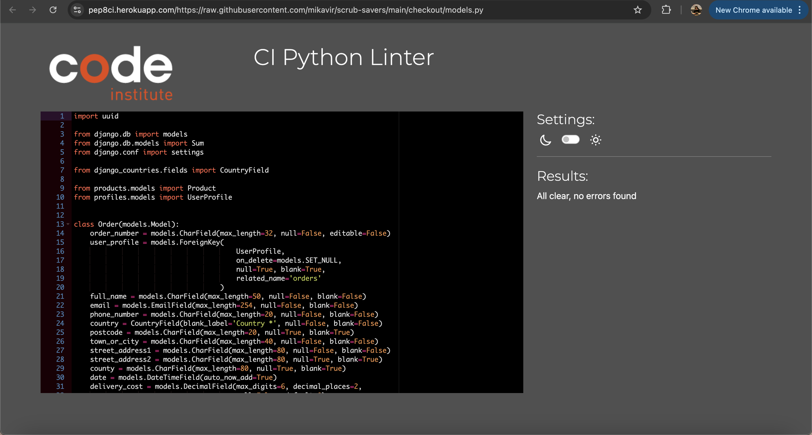 | No errors |
| checkout | signals.py | [PEP8 CI](https://pep8ci.herokuapp.com/https://raw.githubusercontent.com/mikavir/scrub-savers/main/checkout/signals.py) |  | No errors |
| checkout | urls.py | [PEP8 CI](https://pep8ci.herokuapp.com/https://raw.githubusercontent.com/mikavir/scrub-savers/main/checkout/urls.py) |  | No errors |
| checkout | views.py | [PEP8 CI](https://pep8ci.herokuapp.com/https://raw.githubusercontent.com/mikavir/scrub-savers/main/checkout/views.py) |  | No errors |
| checkout | webhook_handler.py | [PEP8 CI](https://pep8ci.herokuapp.com/https://raw.githubusercontent.com/mikavir/scrub-savers/main/checkout/webhook_handler.py) |  | No errors |
| checkout | webhooks.py | [PEP8 CI](https://pep8ci.herokuapp.com/https://raw.githubusercontent.com/mikavir/scrub-savers/main/checkout/webhooks.py) |  | No errors |
| contact | forms.py | [PEP8 CI](https://pep8ci.herokuapp.com/https://raw.githubusercontent.com/mikavir/scrub-savers/main/contact/forms.py) |  | No errors |
| contact | urls.py | [PEP8 CI](https://pep8ci.herokuapp.com/https://raw.githubusercontent.com/mikavir/scrub-savers/main/contact/urls.py) |  | No errors |
| contact | views.py | [PEP8 CI](https://pep8ci.herokuapp.com/https://raw.githubusercontent.com/mikavir/scrub-savers/main/contact/views.py) |  | No errors |
| home | urls.py | [PEP8 CI](https://pep8ci.herokuapp.com/https://raw.githubusercontent.com/mikavir/scrub-savers/main/home/urls.py) |  | No errors |
| home | views.py | [PEP8 CI](https://pep8ci.herokuapp.com/https://raw.githubusercontent.com/mikavir/scrub-savers/main/home/views.py) |  | No errors |
|  | manage.py | [PEP8 CI](https://pep8ci.herokuapp.com/https://raw.githubusercontent.com/mikavir/scrub-savers/main/manage.py) |  | No errors |
| products | admin.py | [PEP8 CI](https://pep8ci.herokuapp.com/https://raw.githubusercontent.com/mikavir/scrub-savers/main/products/admin.py) |  | No errors |
| products | forms.py | [PEP8 CI](https://pep8ci.herokuapp.com/https://raw.githubusercontent.com/mikavir/scrub-savers/main/products/forms.py) |  | No errors |
| products | models.py | [PEP8 CI](https://pep8ci.herokuapp.com/https://raw.githubusercontent.com/mikavir/scrub-savers/main/products/models.py) |  | No errors |
| products | urls.py | [PEP8 CI](https://pep8ci.herokuapp.com/https://raw.githubusercontent.com/mikavir/scrub-savers/main/products/urls.py) |  | No errors |
| products | views.py | [PEP8 CI](https://pep8ci.herokuapp.com/https://raw.githubusercontent.com/mikavir/scrub-savers/main/products/views.py) |  | No errors |
| products | widgets.py | [PEP8 CI](https://pep8ci.herokuapp.com/https://raw.githubusercontent.com/mikavir/scrub-savers/main/products/widgets.py) |  | No errors |
| profiles | admin.py | [PEP8 CI](https://pep8ci.herokuapp.com/https://raw.githubusercontent.com/mikavir/scrub-savers/main/profiles/admin.py) |  | No errors |
| profiles | forms.py | [PEP8 CI](https://pep8ci.herokuapp.com/https://raw.githubusercontent.com/mikavir/scrub-savers/main/profiles/forms.py) |  | No errors |
| profiles | models.py | [PEP8 CI](https://pep8ci.herokuapp.com/https://raw.githubusercontent.com/mikavir/scrub-savers/main/profiles/models.py) |  | No errors |
| profiles | urls.py | [PEP8 CI](https://pep8ci.herokuapp.com/https://raw.githubusercontent.com/mikavir/scrub-savers/main/profiles/urls.py) |  | No errors |
| profiles | views.py | [PEP8 CI](https://pep8ci.herokuapp.com/https://raw.githubusercontent.com/mikavir/scrub-savers/main/profiles/views.py) |  | No errors |
| reviews | admin.py | [PEP8 CI](https://pep8ci.herokuapp.com/https://raw.githubusercontent.com/mikavir/scrub-savers/main/reviews/admin.py) |  | No errors |
| reviews | forms.py | [PEP8 CI](https://pep8ci.herokuapp.com/https://raw.githubusercontent.com/mikavir/scrub-savers/main/reviews/forms.py) |  | No errors |
| reviews | models.py | [PEP8 CI](https://pep8ci.herokuapp.com/https://raw.githubusercontent.com/mikavir/scrub-savers/main/reviews/models.py) |  | No errors |
| reviews | urls.py | [PEP8 CI](https://pep8ci.herokuapp.com/https://raw.githubusercontent.com/mikavir/scrub-savers/main/reviews/urls.py) |  | No errors |
| reviews | views.py | [PEP8 CI](https://pep8ci.herokuapp.com/https://raw.githubusercontent.com/mikavir/scrub-savers/main/reviews/views.py) |  | No errors |
| scrub_savers | settings.py | [PEP8 CI](https://pep8ci.herokuapp.com/https://raw.githubusercontent.com/mikavir/scrub-savers/main/scrub_savers/settings.py) |  | No errors |
| scrub_savers | urls.py | [PEP8 CI](https://pep8ci.herokuapp.com/https://raw.githubusercontent.com/mikavir/scrub-savers/main/scrub_savers/urls.py) |  | No errors |
| scrub_savers | views.py | [PEP8 CI](https://pep8ci.herokuapp.com/https://raw.githubusercontent.com/mikavir/scrub-savers/main/scrub_savers/views.py) |  | No errors |

## Browser Compatibility
I've tested my deployed project on multiple browsers to check for compatibility issues.

| Browser | Bag | Checkout | Checkout-success | Contact | 404 |  Notes |
| --- | --- | --- | --- | --- | --- | --- |
| Chrome |  |  |  | 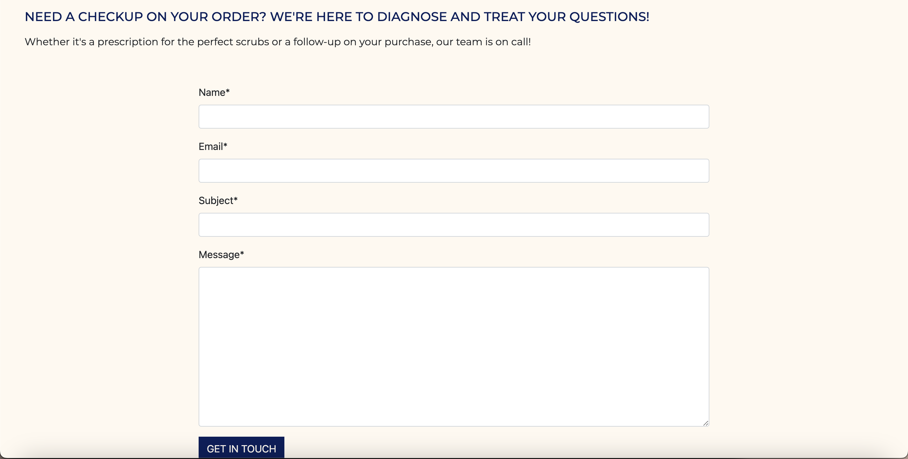 |   | Works as expected |
| Firefox |  |  |  |  |  | Works as expected |
| Safari |  |  |  |  |  | Works as expected |


| Browser | Contact-success | Home | Add Product | Edit Product | Notes |
| --- | --- | --- | --- | --- | --- |
| Chrome |  |    |  |   | Works as expected |
| Firefox |  |   |   |   | Works as expected |
| Safari |  |   |   |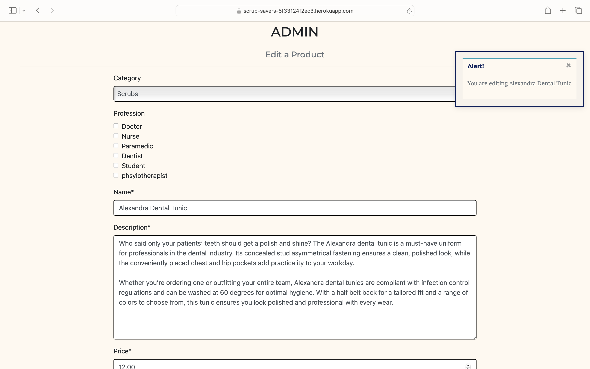   | Works as expected |


| Browser | Product Detail | Products | Profiles | Add Review | Edit Reviews | Notes |
| --- | --- | --- | --- | --- | --- | --- |
| Chrome |  |  |  |  |  | Works as expected |
| Firefox |  |  |  |  |  | Works as expected |
| Safari | 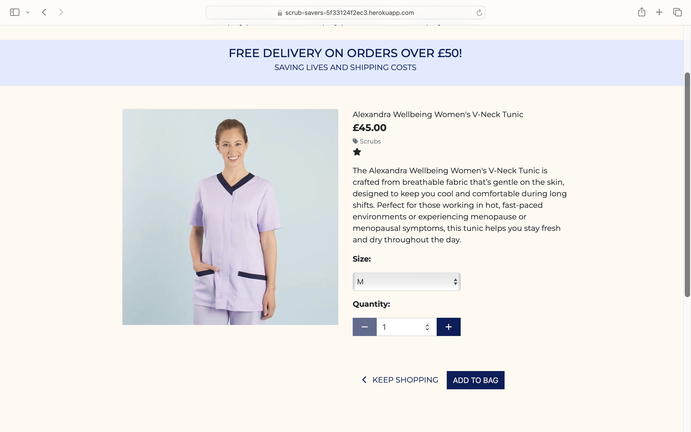 |  |  | 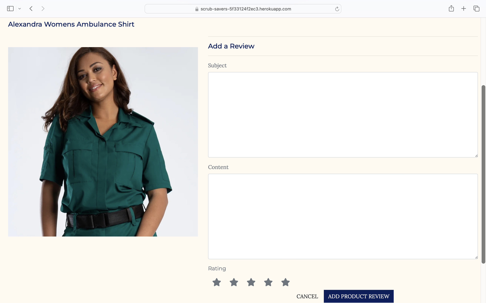 |   | Works as expected |


## Responsiveness

I've tested my deployed project on multiple devices to check for responsiveness issues.

| Device | Bag | Checkout | Checkout-success | Contact | 404 |  Notes |
| --- | --- | --- | --- | --- | --- | --- |
| Mobile (DevTools) 320px |  |  |  | | | Order Number is spilling out of the container. Fix: make order number font smaller |
| Tablet (DevTools) 768px |  |  |  |  |  | Works as expected |
| Desktop |  |  |  |  |  | Works as expected |
| iPhone 13 Pro(personal mobile) |  |    |  |   | 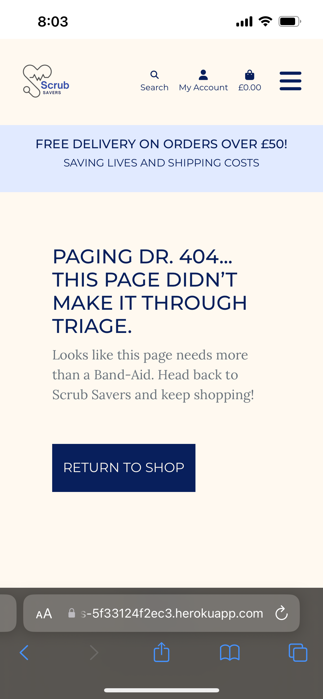 | Works as expected |

| Device | Product Detail | Products | Profiles | Add Review | Edit Reviews | Notes |
| --- | --- | --- | --- | --- | --- | --- |
| Mobile (DevTools) 320px |  |  |  |  |  | Works as expected |
| Tablet (DevTools) 768px |  |  |  | 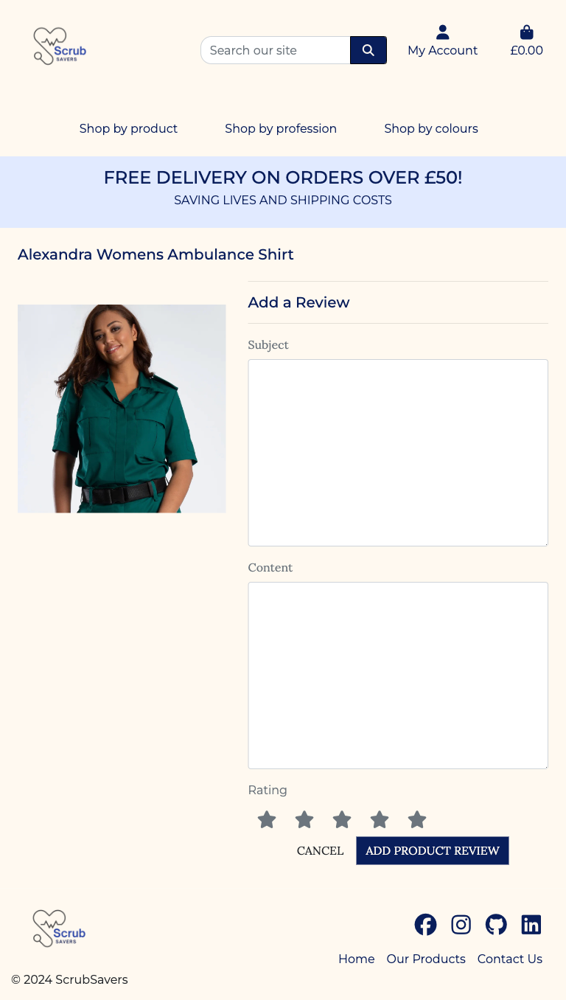 |  | Works as expected |
| Desktop |  |  |  |  |  | Works as expected |
| iPhone 13 Pro(personal mobile) |    |   |  |  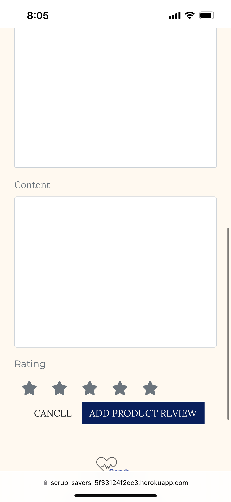|  |Works as expected |

| Device | Contact-success | Home | Add Product | Edit Product | Notes |
| --- | --- | --- | --- | --- | --- |
| Mobile (DevTools) 320px |  |  |  |  | Works as expected |
| Tablet (DevTools) 768px |  |  |  |  | Works as expected |
| Desktop |  |   |   |   | Works as expected |
| iPhone 13 Pro (personal mobile) |  |    |  |  | Works as expected |


## Lighthouse Audit
I've tested my deployed project using the Lighthouse Audit tool to check for any major issues.


| Page | Mobile | Desktop | Notes |
| --- | --- | --- | --- |
| bag | |  | mobile: Improvements to be made to serve images in a next gen format: unable to change this as cloudinary render the images.|
| checkout |  |  | mobile: Affected performance due to render blocking sources such as bootstrap CDN, FontAwesome and Stripe API, Unable to remove these as important for the project's frontend|
| checkout success |   |  | mobile: Affected performance due to render blocking sources such as bootstrap CDN, FontAwesome and Stripe API, Unable to remove these as important for the project's frontend|
| contact |   |   |  No major warnings |
| contact success| 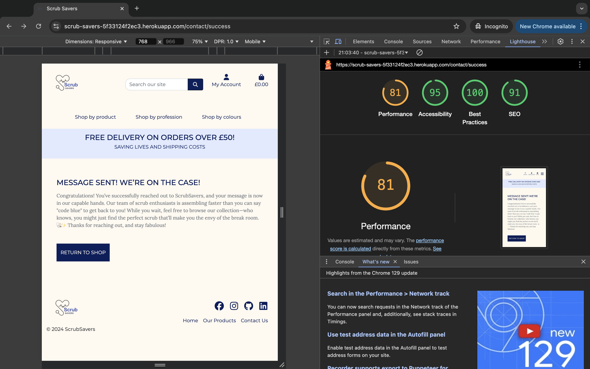 |   | No major warnings|
| home |  | | mobile: Affected performance due to render blocking sources such as bootstrap CDN, FontAwesome and Stripe API, Unable to remove these as important for the project's frontend |
| Add Product Page|  |  | |
| Edit Product |  |  | Affected accessibility due to not having labels with crispy forms |
| Product Detail |  |  | Accessbility to be imr=proved due to no labels to forms |
| products |  |  | Accessbility due to select |
| profiles |  |  | No major warnings|
| Add review |  |  | No major warning |
| Edit Review | |  | No major warnings |


## Defensive Programming
Defensive programming was manually tested with the below user acceptance testing:
### Restricted page and Admin Authentication

| Page | Expectation | Test | Result | Fix | Screenshot |
| --- | --- | --- | --- | --- | --- |
| Profile | | | | | |
| | Logged out users are not able to access profile and should be redirected to sign in page | Tested the feature by doing brute-forcing the url to profile | The feature behaved as expected| Test concluded and passed |  |
| Checkout-success | | | | | |
| | Logged out user should no be able to access other users checkout-success | Tested the feature by brute-forcing the url as a logged out person | The feature was able to access the checkout-success | Test concluded and failed. Will fix |  |
| Add Product | | | | | |
| | Logged out user should not be able to access the add product page and will be redirected to a sign in page| Tested the feature by brute-forcing the url| The feature behaved as expected | Test concluded and passed |  |
| | Standard users are unable to access the add product page and will encounter a message error | Tested the feature by brute forcing the url signed in as a standard user | The feature behaved as expected | Test Concluded and Passed |  |
| Edit Product | | | | | |
| | Logged out user should not be able to access the add product page and will be redirected to a sign in page |  Tested the feature by brute-forcing the url| The feature behaved as expected| Test concluded and passed |  |
| | Standard users are unable to access the add product page and will encounter a message error  | Tested the feature by brute forcing the url signed in as a standard user | The feature behaved as expected | Test Concluded and Passed |  |
| Add Review | | | | | |
| | Logged out user should not be able to access the add review page and will be redirected to a sign in page |  Tested the feature by brute-forcing the url| The feature behaved as expected| Test concluded and passed |  |
| | Users that have not bought the product is unable to add a review and will be lead to an error message | Tested the feature by brute forcing the url signed in as a unverified buyer | The feature behaved as expected | Test Concluded and Passed |  |
| Edit Review | | | | | |
| | Logged out user should not be able to access the edit review page and will be redirected to a sign in page |  Tested the feature by brute-forcing the url| The feature behaved as expected| Test concluded and passed |  |
| | Users that have not made the review is unable to edit other review and will be lead to an error message | Tested the feature by brute forcing the url signed in as a unverified buyer | The feature behaved as expected | Test Concluded and Passed |  |

### CRUD functionality
| Page | Expectation | Test | Result | Fix | Screenshot |
| --- | --- | --- | --- | --- | --- |
| Add Product | | | | | |
| | Admin can add product | Tested the feature by finishing the form and adding a product as an admin | The feature behaved as expected| Test concluded and passed |  |
| Edit Product | | | | | |
| | Admin can edit product | Tested the feature by finishing the form and editing a product as an admin| The feature behaved as expected| Test concluded and passed |  |
| Delete Product | | | | | |
| | Admin can delete product | Tested the feature by clicking delete and proceeding to confirm deletion with a modal | The feature behaved as expected| Test concluded and passed |  |
| Add Review | | | | | |
| | Verified buyer can add a review | Tested the feature by finishing the form and adding a review as a verified buyer | The feature behaved as expected | Test concluded and passed |  |
| Edit Review | | | | | |
| | Verified buyer can edit their own review | Tested the feature by finishing the form and editing a review as a verified buyer and reviewer | The feature behaved as expected | Test concluded and passed |  |
| Delete Review | | | | | |
| | Verified buyer can delete their own review | Tested the feature and deleting the review | The feature behaved as expected | Test concluded and passed |  |
| Profile | | | | | |
| | User can update their personal details | Tested the feature by updating the form  | The feature behaved as expected | Test concluded and passed | 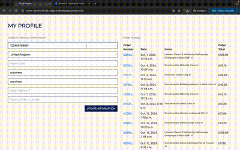 |

### Form validation
The form validation is handled by Django Crispy Forms:

| Page | Expectation | Test | Result | Fix | Screenshot |
| --- | --- | --- | --- | --- | --- |
| Add product | | | | | |
| | Form is expected to not submit and display a error message if one required field is unmet | Tested the feature by doing submitting the form without price | The feature behaved as expected | Test concluded and passed |  |
| Edit Product | | | | | |
| | Form is expected to not submit and display a error message if one required field is unmet | Tested the feature by doing submitting the form without price | The feature behaved as expected | Test concluded and passed |  |
| Add Review | | | | | |
| | Form is expected to not submit and display a error message if one required field is unmet | Tested the feature by doing submitting the form without rating | The feature behaved as expected | Test concluded and passed |  |
| Contact | | | | | |
| | Form is expected to not submit and display a error message if one required field is unmet | Tested the feature by doing submitting the form without valid email and without a message| The feature behaved as expected | Test concluded and passed |  |

## User Story Testing

| User Story | Screenshot |
| --- | --- |
| As a Shopper, I want to be able to view a list of products so that I can select items to purchase. |  |
| As a Shopper, I want to be able to view individual product details so that I can identify the price, description, and product details. |  |
| As a Shopper, I want to easily view the total of my purchases at any time so that I can avoid overspending. | 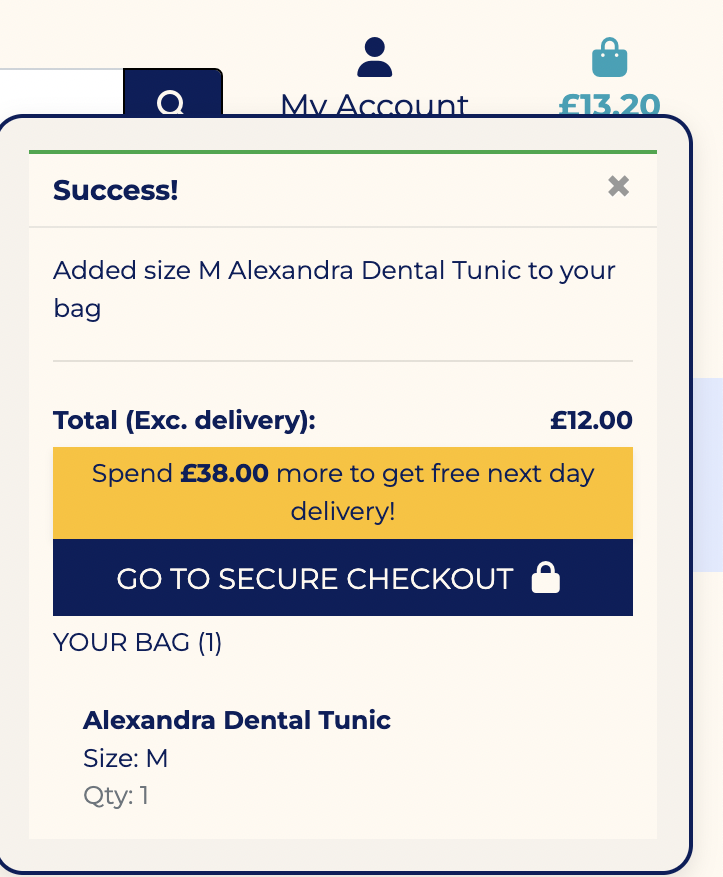 |
| As a Shopper, I want to easily register for an account so that I can have a personal account to view my purchase history. |  |
| As a Shopper, I want to easily log in to my account so that I can keep track of my purchase history.|  |
| As a Shopper, I want to easily log out of my account so that my account is secure when using a public device. |  |
| As a Shopper, I want to have a personalized user profile so that I can view my purchase history, order confirmations, and save my payment history. |  |
| As a Shopper, I want to sort the list of available products so that I can easily identify the best-rated, best-priced, and categorically sorted products. |  |
|  As a Shopper, I want to search for a product by name or description so that I can find the specific product I want to purchase. |  |
| As a Shopper, I want to easily select the size and quantity of a product when purchasing it so that I don't accidentally select the wrong size. |  |
|  As a Shopper, I want to view an order confirmation after checkout so that I can verify that I haven't made any mistakes. | |
|  As a Shopper, I want to adjust the quantity of individual items in my bag so that I can easily make changes to my purchase before checkout. | |
|  As a Shopper, I want to receive an email confirmation after my purchase so that I have a record of my purchase. | | |
|  As a Store Owner, I want to add a product so that I can add new items to my store. | | |
|  As a Store Owner, I want to edit a product so that I can change the product information easily. |  |
|  As a Store Owner, I want to delete a product so that I can remove items that are no longer for sale. |  |
|  As a Store Owner, I want to have a logo so that I can improve my brand identity.|  |
|  As a Shopper, I want to see contact information so that I can feel safe knowing that I can contact someone to remedy any mistakes.|  |
|  As a Shopper, I want to see reviews so that I can understand the quality of the product I'm buying.|  |
|  As a Store Owner, I want to be contacted so that I can improve customer loyalty and understand if there are improvements to be made.||

## Automated Testing

I have conducted a series of automated tests on my application.

I fully acknowledge and understand that, in a real-world scenario, an extensive set of additional tests would be more comprehensive.

### Python (Unit Testing)

I have used Django's built-in unit testing framework to test the application functionality.

In order to run the tests, I ran the following command in the terminal each time:

`python3 manage.py test name-of-app`

To create the coverage report, I would then run the following commands:

`pip3 install coverage`

`pip3 freeze --local > requirements.txt`

`coverage run --omit=*/site-packages/*,*/migrations/*,*/__init__.py,env.py manage.py test`

`coverage report`

To see the HTML version of the reports, and find out whether some pieces of code were missing, I ran the following commands:

`coverage html`

`python3 -m http.server`

Below are the results from the various apps on my application that I've tested:

| App | File |  Screenshot |
| --- | --- |  --- |
| Bag | tests.py |   |
| Home | tests.py |   |
| Products | tests.py |   |
| Contact | tests.py |  |


#### Unit Test Issues

To test the "Add Product" views, I first needed to create a superuser. The test script automatically handles this by creating a superuser and logging them in.
```python
# https://stackoverflow.com/questions/33274874/assertionerror-302-200
        # Log superuserin
        self.client = Client()
        user = User.objects.create_superuser('test_admin', password)
        self.client.force_login(user=user)
```
When testing the views for the reviews section, I faced challenges in simulating a logged-in user who both purchases a product and submits a review. This process was similar to testing the checkout section, where a bag of products is required to proceed.
## Bugs

## Fixed bugs
- Internal sever error due to sample being negative.

    

    - The original code in the home views attempts to render 4 randomly recommended items, but this causes an error when there are fewer than 4 products available.
    
    - *original code:*
    `products = random.sample(products, 4)`
   - To fix this, I added a condition to only sample the products if there are more than 4 available:
    *fixed code*
    ```python
        if len(products) > 4:
        products = random.sample(products, 4)
    ```

- Anonymous user is not iterable
    

    - When an unsigned user attempts to make a purchase, they encounter an internal server error (500) during the checkout success process. This error occurs because the code tries to iterate through an AnonymousUser, which does not have an associated profile.

    To resolve this, I added a condition to check if the user is signed in before attempting to retrieve their profile.

    ```python
    if request.user.is_authenticated:
        profile = UserProfile.objects.get(user=request.user)
        # Attach the user's profile to the order
        order.user_profile = profile
        order.save()
    ```
- Static files was not being collected to staticfiles with deployment.
    

    -After configuring Whitenoise to serve static files, we were unable to collect them into the staticfiles directory. Manually copying static files into the directory didn't resolve the issue, as it failed to include static files from other apps. As a result, critical files like stripe.js were missing, which prevented payments from working during checkout.

    The issue was caused by the incorrect order of apps in the INSTALLED_APPS setting—specifically, `django.contrib.staticfiles` was placed below `Cloudinary`. To fix this, I reordered the apps, ensuring `django.contrib.staticfiles` is listed above `Cloudinary`.
    ```python
    INSTALLED_APPS = [
        '...',
        'django.contrib.staticfiles',
        'cloudinary_storage',
        'cloudinary',
    ]
    ```
- The delete modal was deleting the wrong product. For example, when clicking the delete button for the product "Crocs," the modal incorrectly pointed to "Trousers" instead. After debugging, I discovered that the issue was caused by the product IDs not being unique in the modal, leading to mismatches between the clicked item and the product shown in the modal.

    

To resolve this, I ensured that each product ID was made unique.

- Empty Rating Causes Database Error: When a user submits the form to add a review without selecting a rating, it results in a database error due to the None value being submitted. This issue arose because the form validation was not triggered effectively, as the rating field was not generated using Crispy Forms.

    

To resolve this issue, I implemented validation for the rating field in forms.py by adding a custom validation method within the ProductReviewForm class:
```python
        def clean_rating(self):
            rating = self.cleaned_data.get('rating')
            if not rating:
                raise forms.ValidationError("Please select a rating.")
            return rating
```
I have also implemented additional defensive programming to ensure the form is only submitted if the rating is valid. The updated code checks both the form's validity and whether a rating has been selected:

```python
    rating = request.POST.get('rating')
    if form.is_valid() and rating:  # Check if the form is valid and rating is selected
```

## Unfixed Bugs
- User can bruteforce an URL of another user's checkout-success/ order confirmation if they know the URL. 

    

- I have been exploring solutions to prevent this issue, but they would involve restricting unsigned users from purchasing products. This is a known vulnerability, as noted in the Code Institute's Boutique Ado walkthrough. Additionally, the links are highly unique, making it unlikely that users would remember the exact URL.